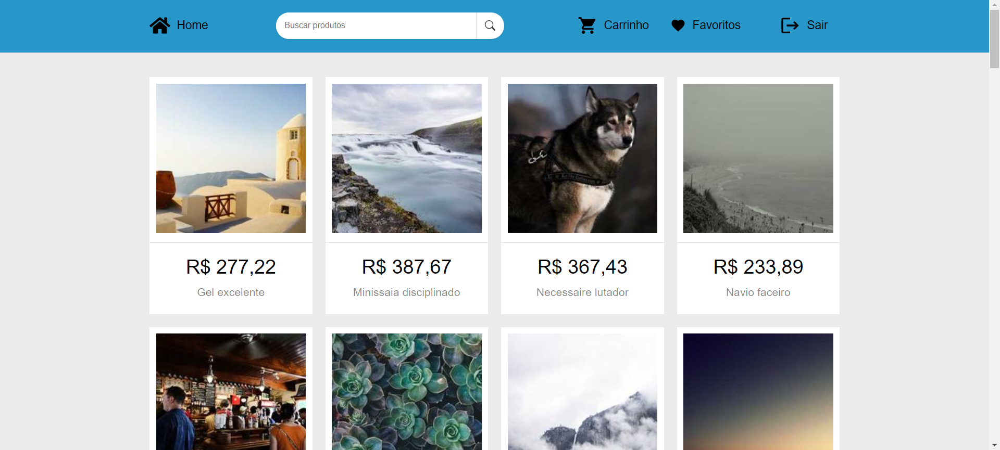

# Shopping

Este é um projeto de uma loja que contém carrinho de compras e favoritos desenvolvido com React JS.

## 🏗️ Tecnologias utilizadas

- React JS: biblioteca JavaScript para construção de interfaces de usuário.
- HTML5: linguagem de marcação para estruturar o conteúdo da aplicação.
- CSS3: linguagem de estilo para estilizar a interface do usuário.
- API Lorem Picsum: para gerar imagens aleatórias

## 🪓 Funcionalidades

- Cadastro/Login
- Adicionar e remover produtos no carrinho
- Adicionar e remover produtos aos favoritos
- Checkout do carrinho que gera um JSON com a lista de produtos

## 🚀 Demonstração



## ⚙️ Como executar

Clone o projeto em sua máquina

```bash
  git clone https://github.com/INTLPiva/shopping.git
```

Abra o projeto

```bash
  cd shopping
```

Instale as dependencias (com yarn ou npm)

```bash
  yarn install
```

Inicie o projeto (com yarn ou npm)

```bash
  yarn start
```
